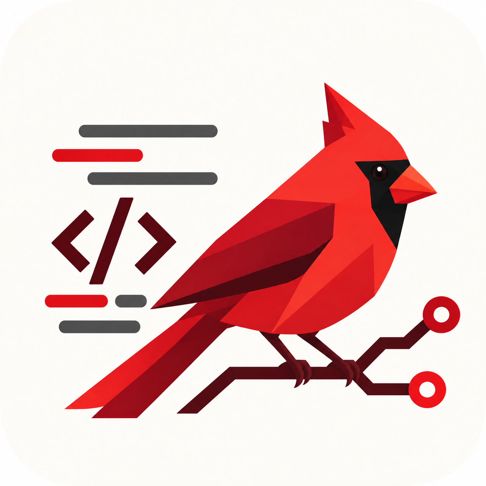

#  Cardinal

Cardinal resolves GitHub issues in repositories it does not own. One orchestrator call decides
whether to take an issue and splits it into tickets; coders implement them in an isolated
worktree against the repository's own tests; a verifier judges the branch at one exact commit;
a PR manager merges only after the required checks pass on that commit; an optional deployment
manager deploys the merge and waits for health. The daemon then watches every check on the merge
commit and files a follow-up issue for one that keeps failing.

The repository holds two packages:

| Package | Role |
|---|---|
| `src/cardinal` | The product: the `cardinal` CLI, graph, store, daemon, agents and skills |
| `src/cardinal_harness` | The grader: drives `cardinal` from outside and checks what it did |

The product never imports the harness or reads its acceptance tests
(`lessons/product-never-sees-the-oracle.md`).

## Install

Cardinal needs:

| Tool | Why |
|---|---|
| Python 3.13+ and [uv](https://docs.astral.sh/uv/) | Cardinal and its lockfile |
| `git` | Clones, worktrees and pushes |
| [`gh`](https://cli.github.com/), logged in with `gh auth login` | Issues, labels, PRs and checks. Git pushes use `gh`'s credential, so that account needs push, pull-request, label and workflow re-run rights on every target repository |
| A model API key | `OPENAI_API_KEY` for `openai:` models, `ANTHROPIC_API_KEY` for `anthropic:` models |
| Whatever the target's `test_command` needs | Cardinal runs that command in each worktree; for example, the live test repository needs Docker |

```sh
git clone https://github.com/oddballmeasure/cardinal.git && cd cardinal
uv sync --locked --extra openai            # Anthropic support is already included
export OPENAI_API_KEY=...                  # read from the process environment only, never from a file
uv run cardinal init --repo owner/name     # writes ~/.cardinal/cardinal.toml
$EDITOR ~/.cardinal/cardinal.toml          # see Configuration below
uv run cardinal repos check                # each probe must print ok before the first run
```

`repos check` probes `gh` authentication, the remote, the base branch, the label set (creating
missing labels), that `test_command` is on `PATH`, and a key for every role's model.

If a target's Docker builds hang with `DeadlineExceeded` on a `FROM` line, the Docker Desktop
credential helper has stopped answering; see `lessons/docker-credential-helper-hang.md`.

## Configuration

Cardinal keeps everything under one home directory: `--home`, else `$CARDINAL_HOME`, else
`~/.cardinal`. It holds `cardinal.toml`, `store.db` (what happened), `checkpoints.db` (what a paused
run does next), `logs/`, shared clones, per-issue worktrees and run context.

`cardinal.toml` refuses unknown keys, and repository decisions have no defaults, so a missing
setting fails loudly instead of running with a guess. `examples/cardinal.toml` is a complete,
commented example.

| Section | Keys | Notes |
|---|---|---|
| `[models]` | `orchestrator`, `profiler`, `coder`, `verifier`, `pr_manager`, `deployer`, `monitor` | Required, each `provider:model` (e.g. `openai:gpt-6-sol`). No role borrows another's |
| `[logging]` | `level`, `source_repo` | Required. `source_repo` is where Cardinal files its own defects |
| `[[repos]]` | `slug`, `base_branch`, `test_command`, `required_checks`, `paths_off_limits`, `paths_hidden` | Required, one table per repository. `test_command` is an argv list (no shell) and is the only test oracle. `required_checks = []` merges without waiting for CI. Agents cannot change `paths_off_limits`, and can neither see nor change `paths_hidden` (for example a grader kept in the repository) |
| | `remote_url`, `branch_prefix`, `retry_after_hours` | Optional. Defaults: `https://github.com/<slug>`, `cardinal`, and no automatic retry (at least 24 when set) |
| `[repos.labels]` | `ready`, `working`, `done`, `error`, `needs_human`, `investigate` | Optional renames of the `cardinal:*` labels |
| `[repos.deploy]` | `transport`, `local_directory` | Optional. `local` or `ssh`; see Deployment |
| `[limits]` | `recursion_limit`, `coder_attempts`, `verify_rounds`, `ci_repair_rounds`, `base_sync_rounds`, `test_timeout_seconds`, `ci_timeout_seconds`, `ci_poll_seconds`, `model_timeout_seconds` | Optional; defaults are in `examples/cardinal.toml` |
| `[ingest]` | `bind`, `token_env` | Optional; enables `cardinal ingest` |
| `[monitor]` | `min_occurrences`, `window_hours`, `max_issues_per_pass` | Optional; enables `cardinal monitor` |

Environment variables:

| Variable | Used for |
|---|---|
| `OPENAI_API_KEY`, `ANTHROPIC_API_KEY` | Model keys, per the provider in each role's spec |
| `CARDINAL_HOME` | Home directory, when `--home` is not given |
| The variable named by `[ingest] token_env` | Bearer token that apps must send to `cardinal ingest`; the endpoint refuses to start without it |
| `CARDINAL_MODEL_PROVIDER`, `CARDINAL_DEPLOY_HOST` | Test hooks only: the grader substitutes scripted models and a mock deploy host through these. Leave unset |

### Deployment

With `[repos.deploy]` set, Cardinal deploys each merge using files committed in the target
repository, read from the merged commit: `deploy.sh` and `deploy.json`, both at the root or
both in `deploy/`. `deploy.json` names `host`, `user`, optional `port` (22),
`working_directory`, `deploy_timeout_seconds`, and a `health` block with `command`,
`expected_stdout`, `timeout_seconds` and `interval_seconds`. The `ssh` transport connects to that
host and user non-interactively, so the host needs key-based login and an entry in `known_hosts`;
`local` runs the script in `local_directory` on this machine.

### Error reporting: ingest and monitor

A running app can send its errors to Cardinal, which files issues for repeated ones:

```sh
export CARDINAL_INGEST_TOKEN=...     # the variable named by [ingest] token_env
uv run cardinal ingest               # serves POST http://<bind>/v1/records
uv run cardinal monitor              # groups errors; files at most max_issues_per_pass issues a pass
uv run cardinal logs schema          # the LogRecord JSON Schema apps write against
```

The app sends `Authorization: Bearer <token>`, and each record's `source.repo` must be a
configured `[[repos]]` slug, or it is rejected. `examples/app.env` shows an app's settings and
`examples/log-record.json` a sample record. Apps in Docker reach an ingest bound to `127.0.0.1`
at `http://host.docker.internal:<port>` on Docker Desktop. The orchestrator triages each filed
issue to `cardinal:ready` (it can write the fix) or `cardinal:investigate`.

## Running

```sh
uv run cardinal run 42                     # one issue, in the foreground
uv run cardinal daemon --once              # every issue labelled cardinal:ready, in number order
uv run cardinal daemon                     # keep polling (every --interval seconds, default 60)
uv run cardinal status 42 --json           # runs, events, agent calls and token use
uv run cardinal resume 42 --approve --note "..."   # answer a run waiting for a person (or --reject)
```

With more than one `[[repos]]` entry, pass `--repo owner/name`.

Cardinal reads model keys from the process environment only. To run it from a key file, export
the file into the process first: `set -a; . ./.env; set +a; uv run --extra openai cardinal daemon`.

### How a run flows

```
profile → intake ─┬─ needs a person → pause (cardinal resume) → intake
                  ├─ question / reject → settle
                  └─ tickets → implement ⇄ verify → sync → publish → PR → deploy? → done
```

- **Profile.** It is stored per repository. Only files whose content hash changed are profiled again.
- **Intake** is one orchestrator call returning an `IntakeDecision`: the issue's kind, its requirements, and 1–4 tickets. It covers both triage and planning.
- **Implement.** Each ticket gets up to `coder_attempts` attempts, each judged by the repository's `test_command`. An accepted ticket is a commit carrying a `Cardinal-Ticket:` trailer, so a restarted run skips work already committed.
- **Verify.** The verifier's assessment is checked against facts the runtime gathers itself: tests at the head commit, test files changed, and off-limits paths untouched. A rejection sends the verifier's findings back as a repair ticket, up to `verify_rounds` times.
- **Sync.** Before publishing, the latest base branch is merged into the verified branch if it moved. A clean merge is tested and goes back to the verifier, whose diff now starts at the new base; a conflict (left in progress, with its markers) or a failing test goes to implement as a `SYNC` ticket, whose commit completes the merge and is refused while markers remain. At most `base_sync_rounds` merges per run; a conflict after that fails as `base_conflict`.
- **PR.** The branch is pushed with a lease. The PR merges only after every `required_checks` check passes on the verified head. GitHub runs no `pull_request` CI on a conflicting PR, so a PR whose `mergeable` turns `CONFLICTING` while waiting goes straight back to sync instead of waiting out `ci_timeout_seconds`. A CI failure names only the required checks that failed.
- **After the merge.** On each poll the daemon reads every check on each merge commit it made, not only the required ones. A failure is re-run once (`gh run rerun --failed`); if it fails again, Cardinal files one issue, `CI failed on <base> after #<pr>: <checks>`, with the log tails, labelled `cardinal:ready`. A follow-up whose own merge fails again is labelled `cardinal:needs-human` instead. Judgements are kept in the store, so a restart never re-files, and a merge still unjudged after six hours is given up.
- **Labels.** Labels form one state axis: `cardinal:ready`, `in-progress`, `done`, `error`, `needs-human` and `investigate`. A failure records a typed `FailureKind`. Retryable failures are re-queued after `retry_after_hours` (at least 24) only when that setting is present.

Agents have no shell. The worktree is the only writable mount. Within it, `.git`, vendor
directories and `paths_off_limits` refuse writes, and the skills and run context are
read-only.

## Grading the product

```sh
uv run --locked python -m pytest -q                              # offline scenarios, no network
uv run --locked python -m cardinal_harness offline --scenario single      # or daemon | ci-failure | ci-repair | deploy | cleaner | monitor | base-sync | post-merge
uv run --locked --extra openai --extra e2e python -m cardinal_harness live --model openai:gpt-6-sol
```

The offline scenarios run the real product against a bare Git remote. `gh` is replaced by a
fake built from the real CLI's surface, models are scripted through `CARDINAL_MODEL_PROVIDER`,
and the deploy host is replaced through `CARDINAL_DEPLOY_HOST`.

Before grading, the live suite clones `https://github.com/oddballmeasure/cardinal_test_repo` into
`tests/blank_repo/` if that checkout is missing. An existing checkout is kept when its
`origin` matches; offline scenarios do not need this network step.

The live suite runs the product's daemon against `oddballmeasure/cardinal_test_repo`, one case
at a time and in suite order:

1. Park every ready issue.
2. Prove the case's acceptance tests fail on the current `main`.
3. Label the case ready and run `cardinal daemon --once`.
4. Grade the run from GitHub, Git refs, `status --json`, and the acceptance tests run cumulatively on the new `main`.

Cleanup always restores the pinned `main` under an exact lease, removes managed PRs and
branches, and restores every parked issue's labels. Every run writes
`artifacts/e2e/<run-id>/report.json` with a rerun command, the product's invocation logs and a
copy of its store.

`tests/blank_repo` is the local copy of the live test repository, a FastAPI, Redis and React
notes service with its own Docker-based HTTP and browser tests. `tests/acceptance` holds the
independent checks for each suite issue.
